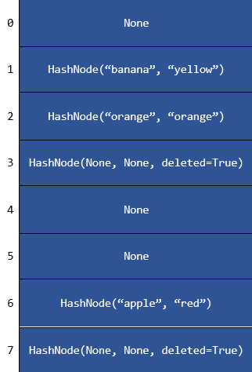

# Project 3: Hash Tables

**Due: Thursday, February 22 @ 9:00 PM ET**

_This is not a team project. Do not copy someone else’s work._

## Assignment Overview

Hash Tables are a very powerful data structure that are best known for their ability to insert, delete, and lookup in
expected run time of O(1) time. This allows them to be very powerful in storing data that needs to be accessed quickly.



```python
>> > print(fruit_colors["banana"])
yellow
```

In this project, you will be implementing a **Hash Table** from scratch in Python and applying it to application
problems.

## Assignment Notes

1. Using any of the following will result in the **loss of all testcase and manual points** associated with the
   violating function.
    1. a Python dictionary or set,
    2. a Python container/collection other than a basic list or tuple
    3. the nonlocal keyword
2. Calling magic or protected methods improperly in this project will result in a **2 point deduction for each
   violation, up to a maximum of 20 points.**

    1. Calling a magic method like \_\_len\_\_() with the syntax `table.__len__()` instead of the proper
       syntax `len(table)` is a violation
    2. Calling a protected method like \_insert() outside of its implementing class, e.g., in the application problem,
       is a violation (use \_\_setitem\_\_() instead)
    3. Read below to learn more about magic methods and protected methods

3. Changing function signatures will result in a **2 point deduction for each violation, up to a maximum of 20 points.**

    1. When working with libraries, open-source codebases, or industry codebases, you will rarely be able to change
       function signatures, so it's good practice to avoid it now!
    2. Changing function signatures will often cause testcases to fail too.

4. In this project, you will be implementing and using many of Python's _magic methods_.

    1. Magic methods have two underscores on the front and the back, such as \_\_len\_\_().
    2. In this project, these magic methods won't be doing much, they will call the other protected methods that you
       write!
    3. In other words, these magic methods should not be more than a few lines.
    4. Refer to the syntax table below to see how the magic methods relate to other methods in this project.

5. In this project, you will also be implementing and using _protected methods_.

    1. Protected methods are methods prefaced with a single underscore, such as a function called \_insert().
    2. Adding this underscore indicates that the function is meant for internal use only, although this is not strictly
       enforced like in C++.
    3. Think of the magic methods as the "interface" and the protected methods as the "implementation".
    4. Refer to the syntax table below to see how the protected methods relate to other methods in this project.

6. Make sure you split the work between the magic and hidden methods appropriately.

    1. The majority of the testing will take place in the magic method testcases of \_\_setitem\_\_(), \_\_getitem\_\_()
       , and \_\_delitem\_\_() to simulate real-world use.
    2. As shown in the syntax table below, however, the magic methods \_\_setitem\_\_(), \_\_getitem\_\_(), and
       \_\_delitem\_\_() will call the protected methods \_insert(), \_get(), and \_delete(), and these protected
       methods should handle all of the logic associated with insertion, lookup, and deletion.
    3. Use the small testcases for the \_insert(), \_get(), and \_delete() functions to make sure you are dividing the
       work properly.
    4. Magic methods should not be more than a few lines.

7. If you inspect **\_hash_1 and \_hash_2**, you will see that they depend on the size of the string. For the purposes
   of
   this assignment, treat these as taking O(1) (constant) time.
8. A few guarantees:

    1. Capacity will not grow past ~1000
    2. All keys will be of type string

9. Space complexity is not going to be a consideration in this project. Maps allocate O(N) space in general. We would
   like to point out that Python's Dictionaries that we all use are space efficient. They are implemented with a space
   consideration in mind, you can read about how they saved on space using this link, it should be an interesting
   article for those of you who are interested in saving
   space [PROOF-OF-CONCEPT FOR A MORE SPACE-EFFICIENT, FASTER-LOOPING DICTIONARY ](https://code.activestate.com/recipes/578375/).
   In this project, due to load factor restrictions, your program will use O(N) space in add and remove methods.
   We **recommend** that your focus should be on auxiliary (additional) memory usage, as a software engineer, try not to
   exceed O(N) auxiliary space usage when it comes to Maps(Hash Tables).

   The following syntax table shows how protected methods, magic methods, and calls to magic methods relate to each
   other.

| Protected                  | Magic                             | How to Use Magic  |
|----------------------------|-----------------------------------|-------------------|
|                            | \_\_len(self)\_\_                 | len(self)         |
| \_insert(self, key, value) | \_\_setitem\_\_(self, key, value) | self[key] = value |
| \_get(self, key)           | \_\_getitem\_\_(self, key)        | self[key]         |
| \_delete(self, key)        | \_\_delitem\_\_(self, key)        | del self[key]     |
|                            | \_\_contains\_\_(self, key)       | key in self       |

## Assignment Specifications

\* Denotes _Expected Run Time Complexity_

#### class HashNode:

_DO NOT MODIFY the following attributes/functions_

- **Attributes**
    - **key: str:** The key of the hash node (this is what is used in
      hashing)
    - **value: T:** Value being held in the node. Note that this may
      be any type, such as a `str`, `int`, `float`, `dict`, or a more
      complex object
    - **deleted: bool:** Whether or not the node has been deleted
- **\_\_init\_\_(self, key: str, value: T, deleted: bool = False) -\> None**

    - Constructs a hash node
    - **key: str:** The key of the hash node
    - **value: T:** Value being held in the node
    - **deleted: bool:** Whether or not the node has been deleted.
      Defaults to false
    - **Returns:** `None`
    - _Time Complexity: O(1)_

- **\_\_str\_\_(self) -\> str** and **\_\_repr\_\_(self) -\> str**
    - Represents the `Node` as a string
    - **Returns:** `str` representation of node
    - _Time Complexity: O(1)_
- **\_\_eq\_\_(self, other: HashNode) -\> bool**
    - Compares to see if two hash nodes are equal
    - **other: HashNode:** The HashNode we are comparing against
    - **Returns:** `bool `stating whether they are equal
    - _Time Complexity: O(1)_

#### class HashTable:

_DO NOT MODIFY the following attributes/functions_

- **Attributes** (you may edit the values of attributes but do not remove them)
    - **capacity: int:** Capacity of the hash table
    - **size: int:** Current number of nodes in the hash table
    - **table: List:** This is where the actual data for our hash
      table is stored
    - **prime_index: int:** Current index of the prime numbers we are
      using in \_hash_2()
- **primes**
    - This is a list of all the prime numbers, from 2 until 8000, used
      for \_hash_2(). This is a \*\*\_class attribute\*\*\*, so it is
      \*\*accessed by HashTable.primes, NOT self.primes()!\*\*
- **\_\_init\_\_(self, capacity: int = 8) -\> None**
    - Construct an empty hash table, with the capacity as specified in
      the input
    - **capacity: int:** Initial capacity of the hash table. Defaults to 8
    - **Returns:** `None`
    - _Time Complexity: O(1)_
- **\_\_str\_\_(self) -\> str and \_\_repr\_\_(self) -\> str**
    - Represents the `HashTable` as a string
    - **Returns:** `str`
    - _Time Complexity: O(N)_
- **\_\_eq\_\_(self, other: HashTable) -\> bool**
    - Checks if two HashTables are equal
    - **other: HashTable:** the hashtable we are comparing against
    - **Returns**: `bool `stating whether or not they are equal
    - _Time Complexity: O(N)_
- **\_hash_1(self, key: str) -\> int**
    - The first of the two hash functions used to turn a key into a
      bin number
    - Assume this is O(1) time/space complexity
    - **key: str:** key we are hashing
    - **Returns:** `int` that is the bin number
    - _Time Complexity: O(1)_ (assume)
- **\_hash_2(self, key: str) -\> int**
    - The second of the two hash functions used to turn a key into a
      bin number. This hash function acts as the tie breaker.
    - Assume this is O(1) time/space complexity
    - **key: str**: key we are hashing
    - **Returns:** `int` that is the bin number
    - _Time Complexity: O(1)_ (assume)

**_IMPLEMENT the following functions_**

- **\_\_len\_\_(self) -\> int**

    - If you see a function prefixed and suffixed with two underscores, that means it is a magic method and should not
      be called directly (we will deduct points for using them directly)!!
      For example, this function is called using the Python built-in len() method and not \_\_len\_\_().
    - Getter for the size of (the number of elements in) the
      HashTable
    - This function should be one line!
    - _Time Complexity: O(1)_
    - **Returns:** `int` that is size of hash table

- **\_\_setitem\_\_(self, key: str, value: T) -\> None**
    - Sets the value with an associated key in the HashTable
        - **_This should be a short, \~1 line function_**. The
          majority of the work should be done in the \_insert()
          method!
    - _Time Complexity: O(1)_
    - **key: str**: The key we are hashing.
    - **value: T**: The associated value we are storing.
    - **Returns:** `None`
- **\_\_getitem\_\_(self, key: str) -\> T**
    - Looks up the value with an associated key in the HashTable
        - If the key does not exist in the table, raises a **KeyError**.
        - **_This should be a short, \~3 line function_**- majority of the work should be done in the \_get() method!
    - _Time Complexity: O(1)_
    - **key: str**: The key we are searching.
    - **Returns:** The value associated to the provided key.
- **\_\_delitem\_\_(self, key: str) -\> None**
    - Deletes the value with an associated key in the HashTable
        - If the key does not exist in the table, it raises a **KeyError**
        - **_This should be a short, \~3 line function_**- majority of the work should be done in the \_get() and
          \_delete() methods!
    - _Time Complexity: O(1)_
    - **key: str**: The key we are deleting the associated value of.
    - **Returns:** `None`
- **\_\_contains\_\_(self, key: str) -\> bool**

    - Determines if a node with the key denoted by the parameter exists in the table
        - **_This should be a short, \~3 line function_**- majority of the work should be done in the \_get() method!
    - _Time Complexity: O(1)_
    - **key: str**: The key we are checking to be a part of the hash table.
    - **Returns:** `True` if key is in the HashTable, `False` otherwise

- **\_hash(self, key: str, inserting: bool = False) -\> int**

    - Given a key string, return an index in the hash table.
    - Should implement probing with double hashing.

        - If the key exists in the hash table, return the index of the
          existing HashNode.
        - If the key does not exist in the hash table (i.e. HashNode is `None` at the key), return the
          index of the next available empty position in the hash
          table.

            - Collision resolution should implement double hashing
              with hash1 as the initial hash and hash2 as the step
              size

        - Note - There are 2 possibilities when hashing for an index:
            - When inserting a node into the hash table we want to
              insert into the next available bin (i.e. HashNode is `None` or _deleted_).
            - When performing a lookup/deletion in the hash table we
              want to continue until we either find the proper
              HashNode (not _deleted_ and matching key) or until we reach a bin that has never held a
              value (a `None` bin). This is to preserve the collision resolution
              methodology.
            - The inserting parameter should be used to differentiate
              between these two cases.

    - _Time Complexity: O(1)_
    - **key: str:** The key being used in our hash function
    - **inserting: bool:** Whether or not we are doing an insertion.
      Important for the reasons described above.
    - **Returns:** `int` that is the bin we hashed into

- **\_insert(self, key: str, value: T) -\> None**

    - Use the key and value parameters to add a HashNode to the hash
      table. **Requires \_grow to work! You should skip down
      to get that function working if you want to finish this one!**
        - If the key exists, overwrite the existing value
        - In the event that inserting causes the table to have a **load
          factor of 0.5 or greater** you must grow the table to double
          the existing capacity. This should be done in the \_grow() method.
        - _Time Complexity: O(1)_
        - **key: str**: The key associated with the value we are storing.
        - **value: T**: The associated value we are storing.
        - **Returns:** `None`

- **\_get(self, key: str) -\> Optional[HashNode]**

    - Find the HashNode with the given key in the hash table.

        - If the element does not exist, return `None`

    - _Time Complexity: O(1)_
    - **key: str**: The key we are looking up.
    - **Returns:** HashNode with the key we looked up.

- **\_delete(self, key: str) -\> None**

    - Removes the HashNode with the given key from the hash table .
        - If the node is found assign its key and value to `None`, and
          set the deleted flag to `True` (creating a new HashNode for this is acceptable).
        - Only decrease the size when a node was found and it's deleted flag is False.
    - _Time Complexity: O(1)_
    - **key: str**: The key of the Node we are looking to delete.
    - **Returns:** `None`

- **\_grow(self) -\> None**

    - Double the capacity of the existing hash table.
        - Do **NOT** rehash deleted HashNodes
        - Must update self.prime_index; the value of
          self.prime_index should be the **index** of the largest
          prime **smaller** than self.capacity in the HashTable.primes
          tuple.
        - **SHOULD USE \_insert()! (Yes, they use each other).**
    - _Time Complexity: O(N)_
    - **Returns:** `None`

- **update(self, pairs: List[Tuple[str, T]] = []) -\> None**

    - Updates the hash table using an iterable of key-value pairs
        - If the value already exists, update it, otherwise enter it
          into the table
        - **Also requires \_insert() to work!**
    - _Time Complexity: O(M), where M is length of pairs_
    - **pairs:** **List[Tuple[str, T]]**: list of tuples (key,
      value) being updated
    - **Returns:** `None`

- **keys(self) -\> List[str]**

    - Makes a list that contains all of the keys in the table
        - Order does not matter!
        - This function, values, and items should be _very_ similar.
        - Be sure to exclude nonexistent (None) HashNodes and deleted HashNodes in this function, as well as in values
          and items!
    - _Time Complexity: O(N)_
    - **Returns:** `List` of the keys

- **values(self) -\> List[T]**

    - Makes a list that contains all of the values in the table
        - Order does not matter!
    - _Time Complexity: O(N)_
    - **Returns:** `List` of the values

- **items(self) -\> List[Tuple[str,T]]**

    - Makes a list that contains all of the key value pairs in the table
        - Order does not matter!
    - _Time Complexity: O(N)_
    - **Returns:** `List` of `Tuple`s of the form (key, value)

- **clear(self) -\> None**
    - Should clear the table of HashNodes completely (as if they were never even there, not deleted), in essence a
      reset of the table
        - Should not modify capacity
        - We recommend O(1) auxiliary space usage in this function
    - _Time Complexity: O(N)_
    - **Returns:** `None`

## Application: Okta's Temporary Replacement


### Background

Okta, MSU's authentication system, is down! The University needs an efficient and temporary system. As a CSE 331
student, it is up to you to create this temporary system, prioritizing speed over security.

### Problem Statement

Create a SessionsTable data structure that records when a user logs in. The SessionsTable will log the user's session by
generating a session ID. The SessionsTable will also be able to determine if a user was online during a certain time. It
is assumed a user is online for 60 minutes after each login.

### Function Signature

- **enroll_user(username: str) -> None**:

    - Checks if user is in the system
        - If a user is not in the system, add them to the system
        - If a user is in the system, do nothing
    - **username: str:** Represents the username of the user.
    - **Returns:** `None`

    - **Constraints:**
        - When a user is enrolled, they are added to the system with an empty list
        - _Time complexity: O(1)_
    - **Examples:**
        - ```python
          table.enroll_user("Hemanth")
          # HashTable should look like {"Hemanth": []}
          ```

- **add_session(self, username: str, timestamp: str) -> None:**

    - Saves a user session by storing it in the hashtable
    - You are not guaranteed that if a session is added at time x, no new sessions will be added on times up to x + 60
      minutes. For example, it could be the case a session is added at 12:30:00 and then another session for the same user is added at 12:45:00, in this case the user should be considered online until 13:45:00, as it uses the later session.
    - If the user is not in the system or the timestamp entered is invalid, do not process the session
        - Timestamp format:
            - HH:MM:SS (e.g. 18:30:46)
        - Feel free to create a helper function to validate the timestamp
    - If everything is valid, generate a session id and store it in the hashtable and store the id and timestamp in the
      table as a tuple: (session_id, timestamp)
        - Requires `_generate_session_id()` to be working.
        - Remember to call `_generate_session_id()` and not `generate_session_id_wrapper()`
        - **_Failure to call the correct function will result in a manual points deduction._**
    - **username: str:** Represents the username of the user in the system
    - **timestamp: str:** The time of the session login
    - **Returns:** `None`

    - **Constraints:**
        - _Time complexity: O(N), where N is the length of the generated session id_
    - **Examples:**
        - ```python
          table.add_session("Hemanth", "12:34:56")
          # HashTable should look like {"Hemanth": [('c222242512', '12:34:56')]}
          # First item in tuple is the session id, second item is the timestamp

          table.add_session("Hemanth", "24:45:30")
          # HashTable should be unchanged due to invalid timestamp
          # Hours must be between 0 and 23.

          table.add_session("Hemanth", "2022-01-19 12:34:56")
          # HashTable should be unchanged due to invalid timestamp
          # Timestamp needs to be in the format of HH:MM:SS (e.g. 18:30:46)
          ```

- **\_generate_session_id(self, username: str, timestamp: str, append: bool = True) -> Optional[str]**:

    - Generate a session id for a newly created session
        - If the username is an empty string, return None
    - This function should **ONLY** be called from `add_session()`. 
      - `generate_session_id_wrapper()` is only to be called from the test cases. 
      - **_Failure to call the correct function will result in a manual points deduction._**
    - This method will involve you constructing a raw id and creating a hashing algorithm
    - A raw id is a string of a username and timestamp combined, the timestamp will either be appended or prepended (
      added to the beginning) depending on the `append` flag.
        - This process is known
          as [Salting](https://auth0.com/blog/adding-salt-to-hashing-a-better-way-to-store-passwords/).
    - Use the two provided constants, `PRIME` and `MAX_OUTPUT` when hashing your raw_id.
        - Loop through each character and multiply the prime number by your current hash value and add the ascii value
          of the current character.
        - Using a certain operator, keep your hash value between 0 and `MAX_OUTPUT`.
        - _Hint: You've seen something similar to this in your project already._
    - Return the resulting number in 10 digit hexadecimal form without the prefix "0x"
        - If your hexadecimal number is less than 10 digits, pad it with zeros.
        - You may find `.zfill()` and `hex()` to be helpful
        - Ex. `0000004ac1`
    - **username: str:** Represents the username of the user.
    - **timestamp: str:** The time when a user logs in
    - **append: bool:** Whether to append or prepend timestamp when creating raw_id
    - **Returns:** `Optional[str]` 10-digit hexadecimal hash

  - **Constraints:**
    - _Time complexity: O(N)_
  - **Examples:**
    - _As a reminder, private methods should not be directly called, this is only used directly for example purposes_
    - _In the real test cases, the wrapper will be called._
    - ```python
      table = SessionsTable()
      # Generates a session for user "Hemanth" at 12 hours, 34 minutes, and 23 seconds
      session_id = table._generate_session_id("Hemanth", "12:34:23")
      # Expected: "c2222424b2"

      # Generating with empty username
      session_id = table._generate_session_id("", "11:32:21")
      # Expected: None
      ```
- **generate_session_id_wrapper(self, username: str, timestamp: str, append: bool = True) -> Optional[str]**:

    - This is a test wrapper function that exposes the private function `_generate_session_id()` to be public to be
      tested.
      - What this means is that this function is **ONLY** called in test cases.
    - **_This should be a short, \~1 line function_**. All of the work is done in `_generate_session_id()`.
    - **username: str:** Represents the username of the user.
    - **timestamp: str:** The time when a user logs in
    - **append: bool:** Whether to append or prepend timestamp when creating raw_id
    - **Returns:** `Optional[str]` 10-digit hexadecimal hash

    - **Constraints:**
        - _Time complexity: O(N)_
      
- **was_user_online(self, username: str, timestamp: str) -> Optional[bool]**:

    - If the username is not present in the system or the timestamp entered is invalid, return None
    - Return True if the user was online at the inputted time, False otherwise
        - Remember that a user is online for 60 minutes after each login
    - Hint: Use of the [datetime](https://docs.python.org/3/library/datetime.html) library, which has already been
      imported, could save you a lot of time
    - **username: str:** Represents the username of the user to look up
    - **timestamp: str:** The time of the session login to look up
    - **Returns:** `Optional[bool]`

    - **Constraints:**
        - _Time complexity: O(N), where N represents the total number of sessions initiated by a user through system
          login_
    - **Examples**

        - ```python
          table.enroll_user("user1")
          table.add_session("user1", "07:11:12")
          table.was_user_online("user9", "07:12:49")
          # Expected: None

          table.enroll_user("user2")
          table.add_session("user2", "01:45:11")
          table.was_user_online("user2", "")
          # Expected: None

          table.enroll_user("user3")
          table.add_session("user3", "07:11:12")
          table.was_user_online("user3", "07:40:01")
          # Expected: True

          table.enroll_user("user4")
          table.add_session("user4", "15:12:04")
          table.was_user_online("user4", "16:12:11")
          # Expected: False

          table.enroll_user("user5")
          table.add_session("user5", "00:05:15")
          table.was_user_online("user5", "04:19:01")
          # Expected: False
          ```

### Note on HashTables

For this task, you're expected to utilize HashTables, treating them like Python dictionaries. However, specific methods
are off-limits:

- **DO NOT use**: `_hash()`, `_insert()`, `_delete()`, `_get()`, and `_grow()`.
- Instead, use magic methods and treat your HashTable as if it were a Python dictionary.

### About Private Methods

While many programming languages strictly enforce private attributes and methods, Python adopts a convention-based
approach. In Python, any method or attribute starting with an underscore (`_`) is deemed "private". This means it should
not be accessed outside its class. However, Python doesn't technically enforce this privacy.

It's essential to honor this convention. Typically, unit tests should test functionality, not the underlying
implementation. In this problem, you should respect both these aspects. Make sure you adhere to this guideline when
crafting your solution.

# **Submission Guidelines**

### **Deliverables:**

For each project, a `solution.py` file will be provided. Ensure to write your Python code within this file. For best
results:

- 📥 **Download** both `solution.py` and `tests.py` to your local machine.
- 🛠️ Use **PyCharm** for a smoother coding and debugging experience.

### **How to Work on a Project Locally:**

Choose one of the two methods below:

---

#### **APPROACH 1: Using D2L for Starter Package**

1. 🖥️ Ensure PyCharm is installed.
2. 📦 **Download** the starter package from the _Projects_ tab on D2L. _(See the tutorial video on D2L if needed)_.
3. 📝 Write your code and, once ready, 📤 **upload** your `solution.py` to Codio. _(Refer to the D2L tutorial video for
   help)_.

---

#### **APPROACH 2: Directly from Codio**

1. 📁 On your PC, create a local folder like `Project01`.
2. 📥 **Download** `solution.py` from Codio.
3. 📥 **Download** `tests.py` from Codio for testing purposes.
4. 🛠️ Use PyCharm for coding.
5. 📤 **Upload** the `solution.py` back to Codio after ensuring the existing file is renamed or deleted.
6. 🔚 Scroll to the end in Codio's Guide editor and click the **Submit** button.

---

### **Important:**

- Always **upload** your solution and **click** the 'Submit' button as directed.
- All project submissions are due on Codio. **Any submission after its deadline is subject to late penalties** .

**Tip:** While Codio can be used, we recommend working locally for a superior debugging experience in PyCharm. Aim to
finalize your project locally before submitting on Codio.

**Grading**

- **As a reminder, the following will result in deduction of points:**

    - A Python dictionary or set
    - A Python container/collection other than a basic list or tuple
    - The nonlocal keyword
    - Any use of the built-in Python sort function in any function of this project

- **Auto Graded Tests (70 points)** see below for the point distribution for the auto graded tests:

    - 00 - test_hash: \_\_/8
    - 01 - test_insert: \_\_/8
    - 02 - test_get: \_\_/5
    - 03 - test_delete: \_\_/5
    - 04 - test_len: \_\_/1
    - 05 - test_grow: \_\_/3
    - 06 - test_setitem: \_\_/1
    - 07 - test_getitem: \_\_/1
    - 08 - test_delitem: \_\_/2
    - 09 - test_contains: \_\_/2
    - 10 - test_update: \_\_/2
    - 11 - test_keys_values_items: \_\_/2
    - 12 - test_clear: \_\_/2
    - 13 - test_setitem_and_delitem: \_\_/2
    - 14 - test_comprehensive \_\_/7
    - 15 - test_enroll_user: \_\_/3
    - 16 - test_add_session: \_\_/4
    - 17 - test_generate_session_id: \_\_/6
    - 18 - test_was_user_online: \_\_/6

**Note on Comprehensive Testing:**

If your solution fails to pass a comprehensive test for a specific function during our assessment, **half of the manual
points allocated for that function will be deducted**. This is to emphasize the importance of not only meeting basic
requirements but also ensuring robustness and correctness in your code. Consider these comprehensive tests as tools for
ensuring quality and resilience in your solutions.

**Additional Note on Scenario Generation:**

While we make every effort to generate test cases that encompass every possible scenario, there might be times when some
edge cases are inadvertently overlooked. Nevertheless, should we identify any scenario where your submitted logic
doesn't hold, even if it's not part of our provided test cases, we reserve the right to deduct from the manual points.
This highlights the significance of crafting logic that doesn't merely pass the given tests, but is genuinely resilient
and correctly addresses the problem's entirety. Always strive to think beyond the provided cases, ensuring that your
solutions are comprehensive and robust.

- **Manual (30 points)**

    - Time and Space complexity points are **divided equally** for each function. If you fail to meet time **or** space
      complexity in a given function, you receive half of the manual points for that function.
    - Loss of 1 point per missing docstring (max 5 point loss)
    - Loss of 2 points per changed function signature (max 20 point loss)
    - Loss of complexity and loss of testcase points for the required functions in this project. You may not use any
      additional data structures such as dictionaries, and sets!

    * M0 - len: \_\_/1
    * M1 - hash: \_\_/2
    * M2 - insert/setitem: \_\_/2
    * M3 - get/getitem: \_\_/2
    * M4 - delete/delitem: \_\_/2
    * M5 - contains: \_\_/1
    * M6 - grow: \_\_/2
    * M7 - update: \_\_/2
    * M8 - keys/values/items: \_\_/2
    * M9 - clear: \_\_/2
    * M10 - enroll_user: \_\_/2
    * M11 - add_session: \_\_/3
    * M12 - _generate_session_id: \_\_/3
    * M12 - generate_session_id_wrapper: \_\_/1
    * M13 - was_user_online: \_\_/3

- **Docstrings** are not provided for this project. Please use Project 1 as a template for your docstrings.
  To learn more on what docstrings are, visit the following
  website: [What are Docstrings?](https://peps.python.org/pep-0257/)

    - Each missing docstring is a 1 point deduction
    - Up to 5 points of deductions

  \_This project was created by Blake Potvin, Arhan Mulay, Ilyas Abdulrahman, and Hemanth Yalamanchili

<input type="checkbox"> <b>STEP 1 :Rename the old solution file by clicking Rename button below. This button renames your file to **solution_old.py** </b>
{Rename}(mv solution.py solution_old.py)
<input type="checkbox"> <b>STEP 2 : Refresh your file tree by clicking on the refresh button under project name or refresh your browser. </b>

<input type="checkbox"> <b>STEP 3 : Upload your **solution.py** from your computer to Codio File Tree on the left. Refresh your file tree or browser to see if it actually updated the solution.py </b>

<input type="checkbox"> <b>STEP 4:Submit your code, by clicking the Submit button, you can submit as many times as you like, no limit on submission.

Submit button is tied to tests.py in our secure folder, and it always gets the updated version of the tests.py. In case
of any tests.py update, students will always get the latest version to test their code through the submit button.
{SUBMIT!|assessment}(test-3379255259)
Please note that there will be manual grading after you submit your work. Clicking Submit only runs the Auto-grader for
the test cases. Manual Grading is 30 points in this project for run time and space complexity.

<input type="checkbox"> <b>STEP 5: Please make sure to **scroll all the way down on Guide Editor page**, Guide is the specs document, it is the document you are reading right now, scroll all the way down, and **click at the Mark as Completed button**, see below for the image of the button so you know what it looks like. Please scroll down and actually push the button. If you do not mark complete yourself, Codio will mark it at the end of the last penalty day, which will give 0 to your project. </b>


{Check It!|assessment}(grade-book-3266829715)
{Submit Answer!|assessment}(free-text-3024451938)
